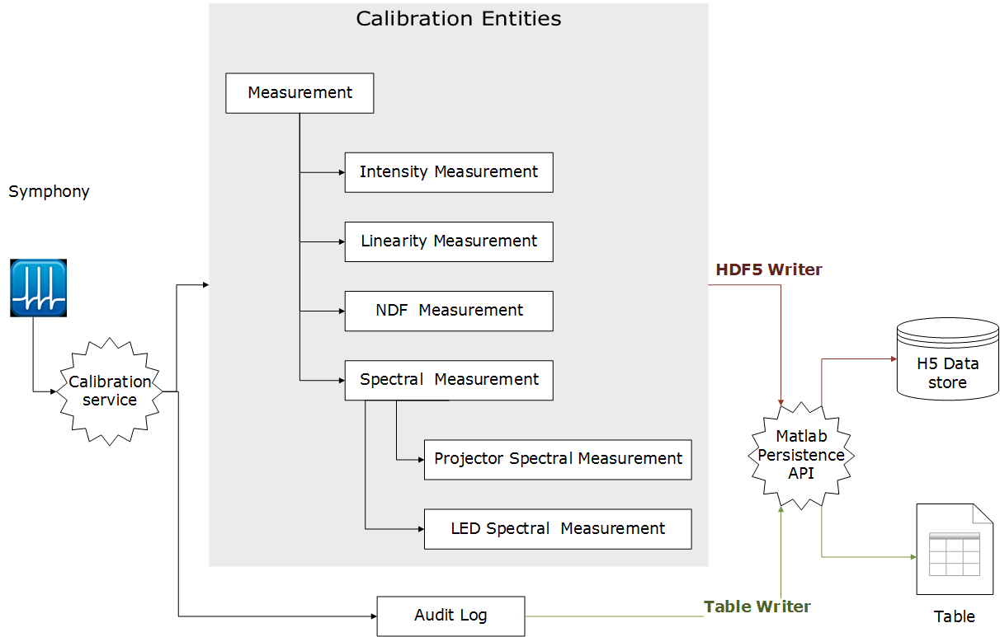

# Calibration Module Ala-Laurila Lab

Calibration module to persist and retrive following

- Spectrum
- NDF transmitance
- Intensity measurement
- Linearity correction

Example : [Calibration Report](reports/projector_calibration_23_Mar_17.ipynb)

## Requirements

- Matlab 2015a+
- [ToolboxToolbox](https://github.com/ToolboxHub/ToolboxToolbox)

## Directory Structure

The project directory structure generally follows the [Maven Standard Directory Layout](https://maven.apache.org/guides/introduction/introduction-to-the-standard-directory-layout.html).

## For Development

1. Download and install [ToolboxToolbox](https://github.com/ToolboxHub/ToolboxToolbox)
2. Restart Matlab
3. `git clone https://github.com/ala-laurila-lab/calibration-module.git` into `<userpath>\projects\calibration-module` folder 
4. open the matlab command window and run `tbUseProject('calibration-module)`

### Matlab dependencies
    
     calibration-module
        |
        |____ app-toolboxes
                |____ mdepin (Matlab dependency injection framework) 
                |____ matlab-persistence (ORM layer for persistence)      

## License

Licensed under the [MIT License](https://opensource.org/licenses/MIT), which is an [open source license](https://opensource.org/docs/osd).
